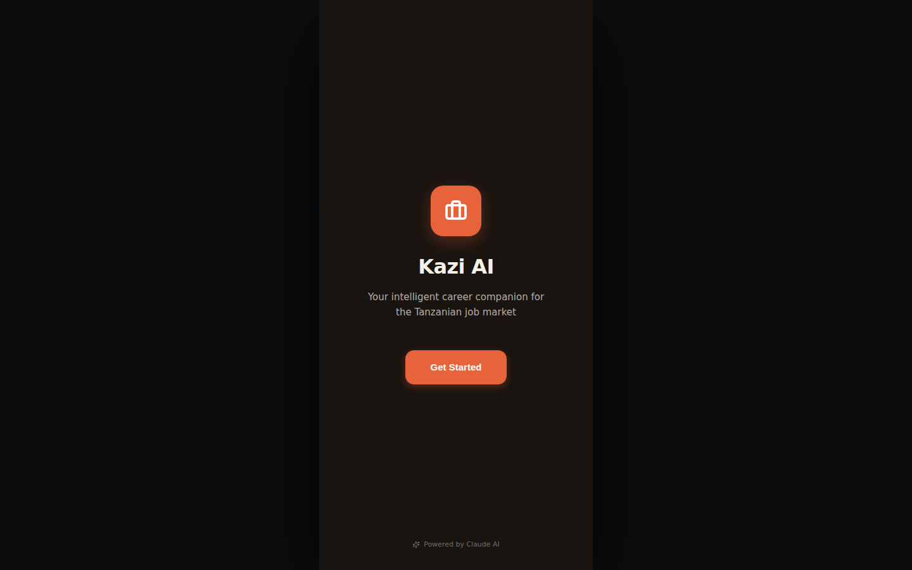

# Kazi AI

**A career and job-search companion — AI-assisted CV building, interview prep, career path exploration, and skills-gap coaching, for job seekers.**


## What this is

Kazi ("kazi" — Swahili for work/job) is a mobile app (Expo) that helps job seekers build stronger applications: a CV builder with AI scoring and summaries, interview prep, a career-path explorer, a networking kit, a soft-skills trainer, and a skills-gap coach. It also includes company/job browsing and an onboarding flow with language selection.



## Status: In active development

This is one of the more feature-complete prototypes in the portfolio (CV builder through interview prep are all built out), but the AI scoring/coaching logic has not been validated against real hiring outcomes, and there's no job-listing data source wired up yet.

### Roadmap
- Wire a real job-listing/company data source
- Validate AI CV scoring against real recruiter feedback
- Backend/persistence layer

## Quickstart

```bash
npm i
npm start          # or: npm run android / npm run ios / npm run web
```

AI features call a small local proxy (`server/index.js`) that holds the
Anthropic key server-side — run it alongside the app (`npm run serve`) with
`ANTHROPIC_API_KEY` set in your environment. See `.env.example`.

## Folder overview

- `app/(onboarding)/` and `app/(tabs)/` — Expo Router screens (the shipping app)
- `app/(tabs)/index.tsx` — CV builder; `app/(tabs)/prep.tsx` — career tools, interview prep
- `server/` — Anthropic API proxy (keeps the key off the client)
- `_archive/` — retired prototypes, not part of the shipping app

## Contributing

See the [org-wide CONTRIBUTING.md](https://github.com/creova-gif/.github/blob/main/CONTRIBUTING.md) for guidelines, including our AI-assisted contribution policy.

## License

Proprietary — © CREOVA. All rights reserved.
